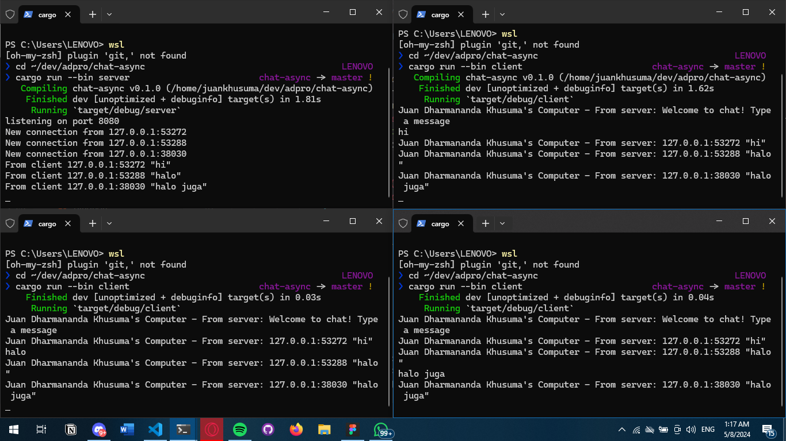

How to run the server and clients
- Open 4 seperate terminals
- Set the current directory to the project directory for all terminals
- On the first terminal, run the server by typing `cargo run --bin server`
- On the other 3 terminals, run the clients by typing `cargo run --bin client`

When a message is typed and sent through the client, the server will recieve the message, prints it, then broadcast the message to all clients. All of the clients will then recieve the message and print it to the terminal.

To modify the port on the server, I needed to change the TCPListener port number in the server.rs file. I also needed to change the port number in the client.rs file to match the server port number. The websocket protocol on the server side is not declared explicitly. On the server code, the port is binded to a TCPListener that assigns a process to listen for any TCP connection going through that port, after a connection is established, the server then creates a socket that is then handed over to the websocket handler. So the server doesn't exactly declares it explicitly but its implementing the websocket protocol specs through the tokio-websocket crate.

I made the changes on the server side, since the server already keeps track which message correspond to which address, that's because when the client first connects, a new asynchronous thread spawns that accepts a stream of messages from that particular client. Each client's host is assigned a thread and handler that is stored inside the addr arguments, this allows me to just insert the address on the message that is broadcasted back to the client.